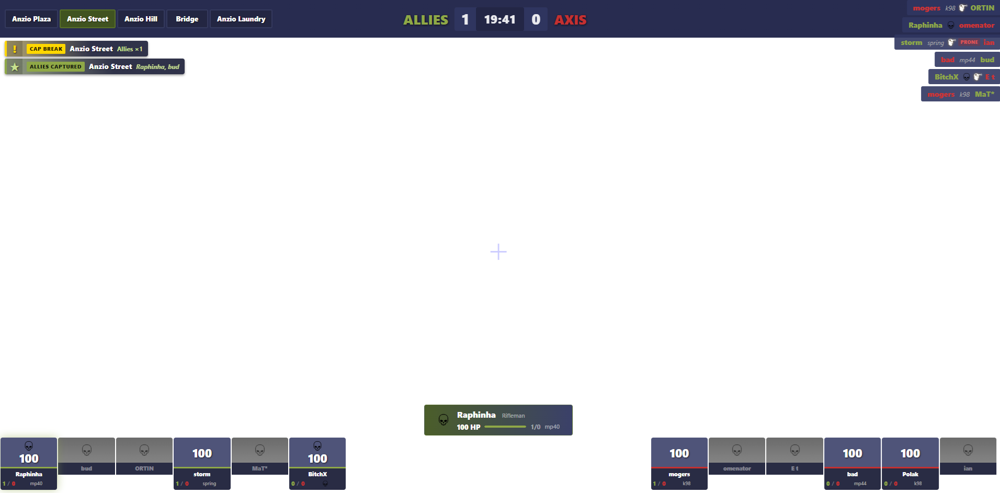

# DoD HUD Observer

Live broadcast overlay for **Day of Defeat 1.3** — an OBS browser source that renders real-time game state (scores, flag captures, player classes, kill feed, prone-shame timer) streamed from a DoD server.



Part of the [KTP League](https://github.com/afraznein) competitive infrastructure, originally retrofit from the CS 1.6 HUD Observer project. See [KTP Stack Dependencies](#ktp-stack-dependencies) for the repos this depends on.

## Viewer Guide

If you just want to know what the overlay is showing on stream, see **[docs/VIEWER_GUIDE.md](docs/VIEWER_GUIDE.md)** — annotated screenshots of each panel. The same guide is available in the running web app at `/help`.

## Features

- **Live scoreboard** — per-player kills, deaths, class, and current weapon for both teams
- **Flag bar** — territorial cap points with live capping / owned state
- **Match timer** — server-synced countdown with drift correction (`time_sync` every 30s)
- **Kill feed** — scrolling notifications with weapon icons and team colors
- **Observed player** — highlights whoever the caster is spectating
- **Prone shame timer** — elapsed timer pinned to any player who goes prone
- **Flag feed** — recent captures and cap breaks, adjacent to the kill feed
- **Match replay** — events are persisted per `matchId`, so completed matches can be replayed

## Architecture

```text
KTP-ReHLDS game server  (extension-mode AMXX — no Metamod)
  └─ KTPHudObserver.amxx
       ├─ uses DODX forwards (spawn, death, prone, cap, team events)
       ├─ hooks ktp_match_start / ktp_match_end from KTPMatchHandler
       └─ POSTs JSON events via KTPAmxxCurl  ──┐
                                                │ HTTP + X-Auth-Key
Web server  ───────────────────────────────────┘
  └─ Node.js backend
       ├─ Express ingest on :8088
       ├─ MatchRecorder  → events.jsonl + metadata.json per match
       ├─ Socket.IO on :4000 (rooms keyed by matchId)
       └─ REST API on :3001 (teams, players, matches)
  └─ React frontend (served on :3000)
       │
       │ HTTP + WebSocket
       ▼
Caster / observer PC
  └─ OBS Studio
       └─ Browser Source pointed at http://<web-server>:3000/screen?server=...
```

The caster's PC does not run any part of this stack — it only opens the published URL in an OBS Browser Source, composited over an HLTV capture of the match. Everything else (ingest, storage, Socket.IO, REST, static frontend) lives on the web server.

**Extension-mode constraint:** the plugin must not depend on Metamod, fakemeta, hamsandwich, or the engine module. The KTP stack loads only `dodx_ktp`, `reapi_ktp`, and `amxxcurl_ktp`. Use HL SDK directly (`edict->v.*`, `g_engfuncs`) or existing dodx natives when adding functionality.

### Ports

| Port | Service                              |
| ---- | ------------------------------------ |
| 3000 | React frontend (OBS browser source)  |
| 3001 | REST API                             |
| 4000 | Socket.IO (backend ↔ frontend)       |
| 8088 | HTTP ingest (plugin → backend)       |

## Quick Start

```bash
# 1. Install dependencies (root + web workspace)
npm install
cd web && npm install && cd ..

# 2. Configure
cp config.example.yaml config.yaml    # set auth key, ports, storage dir

# 3. Run locally
npm run backend   # Node backend with hot reload
npm run web       # React dev server

# 4. Point OBS browser source at http://localhost:3000/screen
```

## Testing Without a Game Server

The mocker replays a 55-second scripted 6v6 match — no HLDS required.

```bash
npm run mocker        # event simulator
npm run web:mocker    # React pointed at the mocker
```

Or run the full Playwright suite that walks the mocker timeline and captures 10 screenshots:

```bash
npm run e2e           # headless
npm run e2e:headed    # visible browser
```

Snapshots land in `e2e/snapshots/` (gitignored) — the same ones used throughout the viewer guide.

## Running the Full Stack Locally

End-to-end testing with real game servers is orchestrated from [KTPInfrastructure](https://github.com/afraznein/KTPInfrastructure) — it builds the KTP-ReHLDS + KTPAMXX game server images and the web server (this repo) as a single compose stack:

```bash
cd ../KTPInfrastructure
make local-up     # ktp-game-1, ktp-game-2, data (all three containers)
make local-logs   # tail all logs
make local-down
```

Two DoD servers come up on `localhost:27016` and `localhost:27017`, posting ingest events to the co-hosted web server on `:8088`. Browser source URL: `http://localhost:3000/screen?server=<server-hostname>`.

For frontend-only iteration with no game servers, this repo's own `docker-compose.yml` spins up just the web-server container (backend + frontend + mocker-ready).

## KTP Stack Dependencies

This project is part of the [KTP League](https://github.com/afraznein) competitive infrastructure. Runtime dependencies:

| Repo | Role |
| --- | --- |
| [KTPInfrastructure](https://github.com/afraznein/KTPInfrastructure) | Docker orchestration, deploy tooling, server inventory — builds this repo's web-server image |
| [KTP-ReHLDS](https://github.com/afraznein/KTP-ReHLDS) | Game server — extension loader that hosts AMXX without Metamod |
| [KTPAMXX](https://github.com/afraznein/KTPAMXX) | AMX Mod X fork providing `dodx_ktp` and `reapi_ktp` modules used by the plugin |
| [KTPAmxxCurl](https://github.com/afraznein/KTPAmxxCurl) | Async HTTP module — the plugin uses it to POST ingest events |
| [KTPMatchHandler](https://github.com/afraznein/KTPMatchHandler) | Emits the `ktp_match_start` / `ktp_match_end` forwards this plugin hooks to bracket a match |
| [KTPhlsdk](https://github.com/afraznein/KTPhlsdk) | Modified HL1 SDK headers — required when building the native modules above |

## Compiling the AMXX Plugin

Source: [`KTPHudObserver.sma`](KTPHudObserver.sma). The compile command (run inside the `jives/hlds:dod` image, because the Linux AMXX compiler needs to resolve includes relative to itself) is documented in [CLAUDE.md](CLAUDE.md#compiling-the-amxx-plugin).

Expected output is ~14.7 KB with one harmless `client_disconnect` deprecation warning.

## Tech Stack

- **Backend** — Node.js, TypeScript, Express, Socket.IO, LowDB
- **Frontend** — React 16, Zustand, Socket.IO client, react-router
- **Plugin** — AMX Mod X (Pawn) targeting KTPAMXX extension mode
- **Testing** — Playwright + headless Chromium, driven by the mocker

## Match Format

- 6v6, Allies vs Axis
- Two halves on the same map — teams swap sides at halftime
- Stats reset on `half_start`; roster is preserved

## Further Reading

- [docs/VIEWER_GUIDE.md](docs/VIEWER_GUIDE.md) — what each panel on the overlay means
- [CLAUDE.md](CLAUDE.md) — full event schema, class IDs, weapon names, compile recipe, architecture notes
- [docs/KTP_PUSH_WORKFLOW.md](docs/KTP_PUSH_WORKFLOW.md) — safety playbook for pushing to `KTPAMXX` / `KTPInfrastructure`

## License

[MIT](https://choosealicense.com/licenses/mit/)
