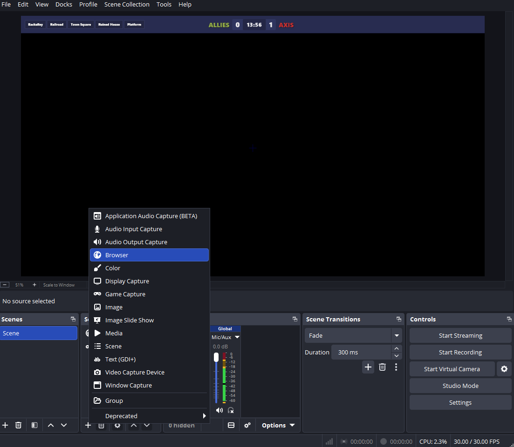
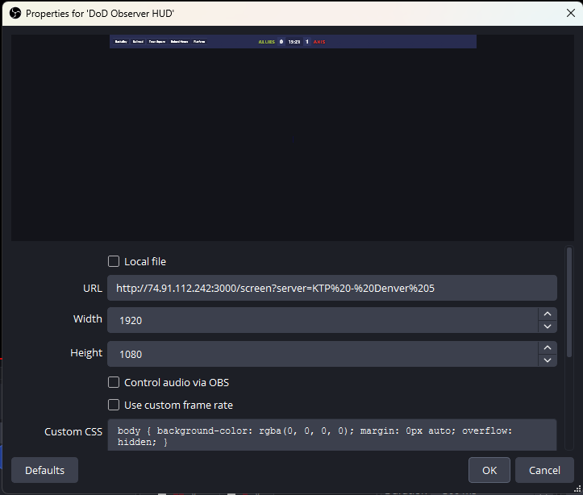

# Viewer Guide

How to get the DoD HUD Observer overlay into OBS, and what the panels on it mean.

This guide is also available inside the running web app at `/help`.

---

## OBS Setup

The overlay runs as a **Browser Source** in OBS, layered over your HLTV capture.

> **This overlay is designed to sit on top of a live HLTV view of the match** — it does not provide the game footage itself. Your OBS scene should already have a capture source (Window Capture, Game Capture, or Display Capture) pointed at an HLTV client connected to the same match. The Browser Source described below is added **above** that capture source so the HUD renders over the live feed.

### 1. Get the overlay URL for the server

1. Open the HUD Observer home page in a browser (e.g. `http://74.91.112.242:3000/`).
2. Click the **Watch / Replay** link.
3. Under **Game Servers**, find the server whose match you're casting.
4. **Right-click the "Watch" (or "Watch Live") link** in the Actions column and choose **Copy link address**.

That gives you a URL like:

```text
http://74.91.112.242:3000/screen?server=KTP%20-%20Denver%205
```

### 2. Add a Browser source in OBS

In OBS, right-click the **Sources** panel → **Add** → **Browser** (or click the **+** under Sources).



### 3. Paste the URL and configure the source

In the Browser source properties:

- **URL** — paste the URL you copied from `/watch`.
- **Width** — `1920`
- **Height** — `1080`
- Leave **Custom CSS** at default; the overlay is already transparent.
- Tick **Refresh browser when scene becomes active** — ensures a clean re-sync between matches.



Make sure this Browser source sits **above** your HLTV capture source in the OBS scene list so the HUD renders on top.

---

## Features


### Flag Bar (top-left)

Live territorial capture points, left-to-right in objective order.

- **Green** — held by Allies
- **Red** — held by Axis
- **Dark / neutral** — uncaptured
- **"capping"** label with player names — the other team is actively on the point

Below the flag bar, a small **flag feed** shows recent captures and **CAP BREAK** events (defender stopped an in-progress cap).

### Score and Timer (top-center)

- Team labels — **ALLIES** (green) and **AXIS** (red), fixed for the match
- Flag-capture score for the current half (resets 0–0 at halftime)
- Match timer — `mm:ss` remaining, server-synced every 30s so it can't drift

### Kill Feed (top-right)

Scrolling kill notifications.

- Killer (left) and victim (right), colored by team
- Weapon icon in the middle (`garand`, `mp40`, `bar`, `mg42`, …)
- **Headshot** icon (yellow-glow helmet) next to the weapon when the kill was a headshot
- **Kill-streak badge** — a yellow `3K` / `4K` / … tag appears in front of the killer's name once they've chained three or more kills without dying. Resets on death or round start.
- **PRONE** tag on the victim side when the kill landed on a prone/deployed player
- Suicides and team-kills styled distinctly

### Player Cards (bottom)

Six cards per team along the bottom — Allies left, Axis right.

- Large **HP** number (greys out on death, refills on respawn)
- **Skull icon** when dead
- **Name** and current-class **primary weapon**
- **Kills / Deaths** for the current half (green / red)

Cards update instantly on spawn, death, class change, and kill.

### Prone Shame Timer

DoD is a movement game; camping prone is frowned on in competitive play. The overlay calls it out:

- A red **PRONE** timer appears on the player's card the moment they go prone or deploy
- It ticks up in seconds from a server-provided timestamp (drift-proof)
- It clears on stand-up, respawn, or death
- Kill-feed entries also carry a **PRONE** tag if the victim died while prone

### Halftime and Match End

At halftime (`half_start`, half 2):

- Scores reset to 0–0
- Per-player kill/death counters reset
- Flag bar resets to starting ownership
- The roster persists — same players, swapped sides

At match end the HUD freezes on the final state until the next match starts or the browser source is refreshed.

---

## Future Features

Not yet built — tracked for a later release:

- **Match replay** — play back a completed match from its recorded `events.jsonl`. The `?replay=true` query parameter is reserved for this and currently has no effect.
- **HLTV sync via HLAE** — align the overlay's event timeline with a demo playing in HLTV / Half-Life Advanced Effects, so the HUD matches a rewatched demo frame-for-frame.
- **Observed-player card** — a bottom-center card showing whichever player the caster is currently spectating. The HUD plugin can't yet tell which player the HLTV client has focused on, so this is shelved until we have a signal to drive it.

---

## Troubleshooting

- **Blank overlay** — confirm the backend is reachable on `:4000` (Socket.IO) and `:3001` (REST). Check the browser dev console for connection errors.
- **Wrong server showing** — the `?server=` value must match the server's registered hostname exactly, including case and spaces (URL-encoded). Visit `/watch` to get the correct copy-paste URL.
- **Timer drifting** — the server sends a `time_sync` every 30s; if the displayed timer is more than a few seconds off, the Socket.IO connection may be dropping.
- **Players missing from roster** — player cards populate on `player_spawn`. New connections who haven't spawned yet won't appear until their first spawn.
- **Wrong flag order / names** — `flags_init` fires once per map load. Reload the map to resend.

See [CLAUDE.md](../CLAUDE.md) for the full event schema and architecture details.
